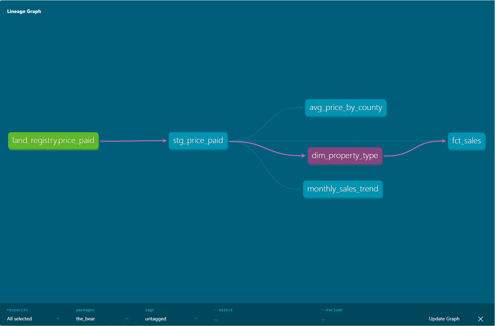

# UK Property Price Pipeline (dbt + DuckDB)

An analytics-engineering pipeline that transforms ~880,000 UK property
sale records from HM Land Registry into clean, tested, business-ready
tables using dbt and DuckDB.

## What it does

Raw Land Registry "Price Paid" data (one year, 879,386 transactions)
flows through three layers:

- **Source** — the raw yearly CSV, declared as a dbt source
- **Staging** (`stg_price_paid`) — columns renamed and typed, light cleaning
- **Marts** — business-ready aggregates:
  - `avg_price_by_county` — average and median sale price by region
  - `monthly_sales_trend` — sales volume and average price by month

## Pipeline

## Data quality

Six dbt tests run on every build: uniqueness and not-null on the
transaction key, not-null on price and date, and accepted-values checks
on the property type and old/new fields. All passing across all records.

## Tech stack

dbt Core, dbt-duckdb, DuckDB.

## Running it locally

1. Download a yearly Price Paid CSV from
   https://www.gov.uk/guidance/about-the-price-paid-data
2. Place it in a `data/` folder (the file is gitignored due to size).
3. Update the `external_location` path in `models/staging/_sources.yml`
   to point to your CSV.
4. Run `dbt run` to build, then `dbt test` to validate.